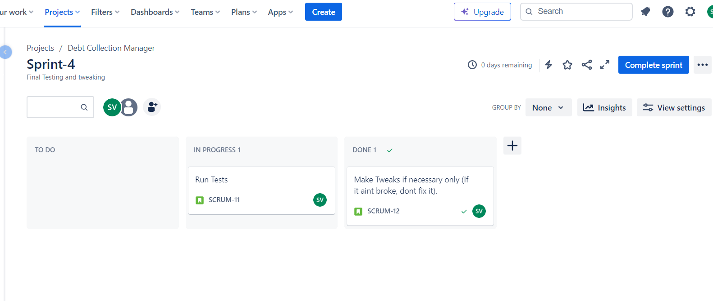

# About Debt-Collection
A simple Debt Collection (Vasooli) manager created using the Flask framework.
An employee of a debt collection agency(user) will login to this application and will manually create new records of people given debts by loan sharks.
They will update the records daily in case a payment is made by the borrower. 
After a debt has been paid in full, the record will be deleted!

___
# Table of Content
* [Languages used](#languages-used)
* [Requirement Engineering](#requirements-engineering)
* [Installation](#installation)
* [UML](#uml-diagrams-)
* [DDD](#ddd)
* [Code Metrics](#code-metrics)
* [Licence](#licence)

# Languages used
1. Python - Uses the Flask Framework
2. HTML, CSS and Bootstrap 

___

# Installation
## Pre-requisites:
1. ### The latest Python or a Python IDE such as PyCharm Community Edition
2. ### The following Python libraries :
* Flask
* Flask-SQLAlchemy
* Flask-WTF
* Flask-login
* werkzeug (For hashing passwords)
## Getting it to run:
* After you have setup your project on your IDE and have installed the above-mentioned packages, Clone this git.
* After cloning, you will need to create a Database using the below-mentioned steps
1. open python console
2. type - from models import app, db
3. type - app.app_context().push()
4. type - db.create_all()
* This will create the Database.
* After Database if created, open the Terminal and run the command - python main.py
* This will run the website on port 5000 on your local machine. /127.0.0.1:5000

___
# UML Diagrams :
* UML or Unified Modeling Language Diagrams are ways to represent the design, architecture and working of an application.
1. ### Use case diagram:
* As of now, there is only one user model defined who can login, register, logout, View the loan dashboard, perform actions on Loans like Add, delete, edit and search loan and View loan records.
Use case diagram : https://github.com/Spinal-Tap369/Debt-Collection/blob/main/uml/use-case-diagram.png
2. ### Class Diagram:
* There are two main classes, Loan and User. The remaining classes are forms which are used for the various operations such as login, register, add loan, search loan, delete loan and edit loan etc.
Class diagram : https://github.com/Spinal-Tap369/Debt-Collection/blob/main/uml/class-diagram.png
3. ### Activity Diagram:
* The activity diagram describes the workflow of the Debt Collection Manager.
Activity Diagram : https://github.com/Spinal-Tap369/Debt-Collection/blob/main/uml/activity-diagram.png
___
# Requirements Engineering
* The Various features to be added to the Debt-Collection manager has been planned out on Jira and [Notion](https://www.notion.so/2621f4fd7a4d4274a5279a8e3245c9da?v=2201760d1ae14df3811f3834e85cf147&pvs=4) and [Jira](https://spinal-tap369.atlassian.net/jira/software/projects/SCRUM/boards/1).

___
# Analysis
The Debt collection Manager is a tool used by employees at a Debt Collection agency to keep track for disbursed loans and their details (Loan).
[Analysis Checklist](https://www.notion.so/Debt-Collection-Manager-checklist-33aced09cc704a7c867808fe7b5e1e58?pvs=4)
## Analysis checklist
You can find my Analysis for the Semester project [here](https://www.notion.so/Semester-Project-Start-up-Analysis-6df138d5b46f42dbad50a70bbb75e87d?pvs=4)
___
# DDD
In order to make good use of the 100,000,000 euros provided by Edlich-Investment, this simple application can have much more domains and functionalities.
## Event storming: Find the chaotic event storming session points [here](https://github.com/Spinal-Tap369/Debt-Collection/blob/main/uml/Event_storming.png)
After event Storming, the following domains were decided [Domain Allocation Diagram](https://github.com/Spinal-Tap369/Debt-Collection/blob/main/uml/Domain_allocation.png).
### 1. Loan Application: 
Deals with Loan application processes such as submitting an application, approving/rejecting etc.
### 2. User Authentication:
This Domain will take of registering and logging-in/logging-out the various users of this application.
### 3. Loan processing:
Deals with various aspects of a loan such as disbursement, check if it is repaid or has the loan been defaulted.
### 4. Risk Assessment: 
Risk Assessment domain will have a part in deciding weather a loan is provided to an applicant or not.
### 5. Payment gateway:
This domain will take care of all payment related operations in our application
### 6. Notification:
As the name suggests, this domain deals with sending Notifications to users.
### 7. Audit Log:
The Audit log domain will create logs such as payment history, borrower track record, collateral details etc.
### 8. Credit Score:
This domain is responsible to check and send updates regarding Credit score.

## Core Domain Chart:
https://github.com/Spinal-Tap369/Debt-Collection/blob/main/uml/DDD_Core_domain_chart.png
## Relation between the Domains :
[Domain Relation Diagram](https://github.com/Spinal-Tap369/Debt-Collection/blob/main/uml/Domain_rel_diagram.png)
### Loan App and User Auth:
* User registration triggers Loan Application creation.
* User login is required for loan application submission.
### Loan App and Loan Processing:
* Loan approval triggers loan processing events.
* Loan rejection leads to further handling in loan processing.
### Loan Processing and Risk Assessment:
* Risk assessment events influence loan processing decisions.
### Loan Processing and Payment Gateway:
* Loan issuance triggers payment initiation.
* Successful payments lead to loan repayment events.
### Notification and Loan Processing:
* Notifications are sent based on loan processing events.
### Audit Logging and all Domains:
* Audit logs are created for important events across all domains.
### Credit Scoring and Loan Processing:
* Credit score checking is part of the risk assessment in Loan processing.

___
# Code Metrics

___
# Clean Code Development
## Clean Coding principles followed in my Web-Application
1. [Meaningful Variable and Function Names](https://github.com/Spinal-Tap369/Debt-Collection/blob/main/main.py#L13): The variable and function names are meaningful and follow a clear naming convention. For example, load_user, handle_invalid_login, and add_loan_to_database have names that convey their purpose.
2. [Consistent Formatting](https://github.com/Spinal-Tap369/Debt-Collection/blob/main/main.py#L25): The code maintains consistent formatting and indentation throughout, contributing to its readability.
3. [Separation of Concerns](https://github.com/Spinal-Tap369/Debt-Collection/blob/main/main.py#L4C6-L4C12): The code is organized into separate files (main.py, models.py, forms.py, and separate routes in routes.py), adhering to the separation of concerns principle.
4. [Use of Flask Features](https://github.com/Spinal-Tap369/Debt-Collection/blob/main/routes.py#L1): The code leverages Flask features, such as Flask-Login, to handle user authentication. This is a good practice as it utilizes well-established and secure authentication mechanisms.
5. [Error Handling](https://github.com/Spinal-Tap369/Debt-Collection/blob/main/routes.py#L1): Error handling is implemented for database queries and operations, providing meaningful error messages for debugging.
## CCD Cheetsheet points
1.  Meaningful Variable and Function Names
2.  Consistent Formatting - Maintain consistent indentation and formatting throughout the code.
3.  Modularization and Reusability = Break down complex logic into smaller, modular functions.
4.  Comments and Documentation - Provide inline documentation for functions and classes.
5.  Follow Best Security Practices 
6.  Validation and Input Sanitization - Sanitize and validate inputs to prevent security vulnerabilities.
7.  Optimized Database Queries - Use appropriate indexes for frequently queried fields.
8.  Configuration Management - Manage configuration settings in a central location and Use environment variables for configuration sensitive information.
9.  Clean and Readable HTML Templates
10. Code Reviews - Conduct code reviews to get feedback from peers and 
___
# Build Management
___
# Unit Tests
The following unit test cases have been made and run through pytest. The script can be found [here](https://github.com/Spinal-Tap369/Debt-Collection/blob/main/test_main.py)
1. Register new user - username : tim123, password : tim123, Date of birth : 12/9/2012
2. Login using tim123
3. Add a loan as user tim123 with the following loan details -> Loan Number: 99999, Borrower's Name: Sanjay, Amount Owed: 1000, Borrower's Address : Mumbai, Borrower's contact number : 100
4. After Loan is added, test search loan functionality with the following Loan number : 99999
5. After testing search feature, test delete feature by deleting Loan number : 99999
6. Logout the User : tim123
7. Login as SysAdmin -> username : sysadmin, password : root69
8. Change password of user tim123 to 1234root
9. After changing password, delete the user tim123
10. Logout of SysAdmin
___
# Licence:
This application is under the MIT Licence.

